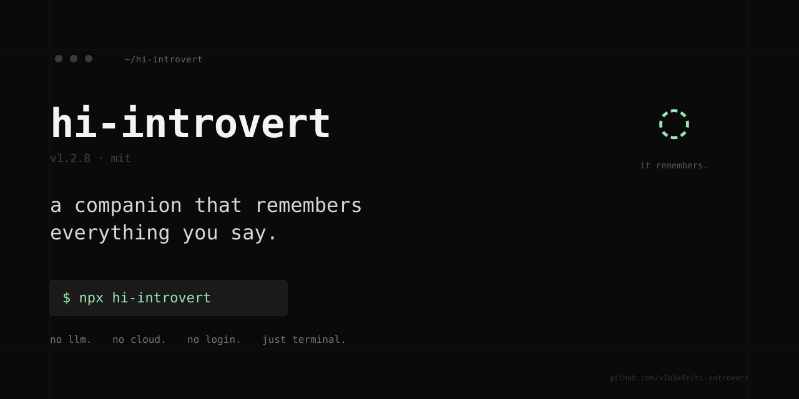

# hi-introvert — repo guide



A terminal companion experiment. This README is for developers reading the source. For the user-facing intro, see [docs/readme-npm.md](./docs/readme-npm.md) or `npx hi-introvert`.

```bash
git clone https://github.com/v1b3x0r/hi-introvert
cd hi-introvert
bun install
bun run dev
```

---

## What's in this repo

```
hi-introvert/
├── bin/hi-introvert.js          # CLI entry (loads dist/index.js)
├── src/
│   ├── index.tsx                # bootstrap — renders <App> into Ink
│   ├── ui/ink/                  # Banner, ChatView, StatusRow, InputBox, Footer
│   ├── session/
│   │   ├── WorldSession.ts      # the wiring layer — owns the World and the chat loop
│   │   ├── ContextAnalyzer.ts   # intent + keyword extraction + relevant memory retrieval
│   │   ├── MemoryPromptBuilder.ts
│   │   └── GrowthTracker.ts
│   ├── sensors/                 # OS, Moon, LocalContext, OutsideWeather, charger
│   ├── vocabulary/              # tokenizer, base vocab, tracker
│   └── utils/                   # tokenize, name-detect, mdm-tokens, ...
├── entities/
│   ├── companion.mdm            # default — 26 lines, english, minimal
│   └── companion-th.mdm         # preserved bilingual variant (244 lines)
├── tests/                       # bun test — 115 pass / 1 skip
├── scripts/
│   └── smoke-name-recall.ts     # non-interactive driver for live behavior
├── docs/superpowers/
│   ├── specs/                   # design documents
│   └── plans/                   # implementation plans
└── dist/                        # build output (gitignored except in tarball)
```

## Architecture

Three layers, each with one job:

```
@v1b3x0r/mds-core
  └── ontology engine. World, entities, emotion (PAD model), proto-language
      generator, lexicon crystallization, CRDT memory log, trust system.
      The "thinking" lives here.

hi-introvert/src
  └── wiring. Loads .mdm files into a World, registers OS/moon/weather/charger
      sensors, holds the chat-loop in WorldSession.handleUserMessage,
      maintains privacy + autosave state, exposes events for the UI.

hi-introvert/src/ui/ink
  └── presentation. Ink + React. Five small components, no logic. Subscribes
      to WorldSession events; emits user input downward.
```

The engine never imports the UI. The UI never imports the engine directly — it goes through `WorldSession`. Sensors are mostly `setInterval`s living inside `WorldSession.setupEnvironmentSensors`, captured for clean shutdown.

## Local development

```bash
# install deps
bun install

# run dev (TUI)
bun run dev
# = bun run src/index.tsx

# run a non-interactive smoke (drives a real WorldSession w/o React)
bun run scripts/smoke-name-recall.ts

# tests
bun test

# build the distributed bundle
bun run build
# = bun build src/index.tsx --outdir dist --target node --format esm \
#   --external @v1b3x0r/mds-core --external ink-big-text --external cfonts
```

Requires Node 18+ at runtime (uses `Intl.Segmenter('th')` for Thai segmentation). Bun is used for build + test but the runtime artifact runs under Node.

## Tests

`bun test` covers:

- Sensor parsers (OS, moon, local context, outside weather)
- Vocabulary tracker
- Autonomous scheduler (cooldown gate / proto-first priority)
- Name-detect (TH + EN patterns + false-positive guards)
- End-to-end name recall through `WorldSession`
- Emotional maturity formula
- Skills survival across save/load round-trip
- Regression suite (`tests/regressions/`) for fixed bugs

The smoke driver at `scripts/smoke-name-recall.ts` is a playwright-style entry point — it constructs a real `WorldSession`, drives turns through `handleUserMessage`, and prints replies. Useful for reproducing live behaviour without React/Ink in the loop.

## Writing your own companion

A companion is a JSON file (`.mdm`). The default ships at `entities/companion.mdm` and is intentionally small — ~26 lines — so the engine carries the showcase weight. Edit the file, restart, watch what changes.

Minimum viable companion:

```json
{
  "$schema": "https://mds.v1b3.dev/schema/v5.7",
  "material": "entity.companion",

  "essence": {
    "en": "describe your companion in one or two sentences."
  },

  "languageProfile": {
    "native": "en",
    "weights": { "en": 1.0 }
  },

  "emotion": {
    "base_state": "neutral",
    "transitions": [
      { "trigger": "user.praise",    "to": "happy",    "intensity": 0.5 },
      { "trigger": "user.criticism", "to": "sad",      "intensity": 0.4 },
      { "trigger": "user.question",  "to": "thinking", "intensity": 0.3 },
      { "trigger": "user.greeting",  "to": "curious",  "intensity": 0.3 }
    ]
  },

  "dialogue": {
    "intro": [
      { "lang": { "en": "your first lines, cold-start. used until vocab hits ~20 words." } }
    ]
  }
}
```

Fields the hi-introvert code reads:

| Field | Where it's used |
|---|---|
| `essence` (string or `{en\|th: ...}`) | Stored as the companion's `self` memory at spawn. Used by `MemoryPromptBuilder` if LLM mode is ever enabled. |
| `languageProfile.native` / `weights` | Read by mds-core for language selection in proto-language and dialogue. |
| `emotion.base_state` + `transitions` | mds-core calls `checkEmotionTriggers()` on every user turn; without transitions emotion stays neutral. |
| `dialogue.intro` | Cycled by `companion.speak('intro')` during the cold-start window (vocab < 20). |
| `dialogue.<category>` | Anything keyed by category name is callable via `companion.speak('<category>')`. The engine falls through to proto-language if a category has no matching line. |

Fields the engine + code currently ignore (decoration only):

- `physics`, `manifestation` — visual/renderer-only.
- `memory` schema block, `cognition`, `world_mind`, `relationships`, `behavior.*` — decorative documentation. Actual config comes from runtime construction in `WorldSession`.
- `skills.learnable` — skills are seeded by `initializeCompanionSkills()` in code, not from the MDM file.

Strip everything you don't need. The shorter the seed, the more the engine speaks for itself.

A fuller authored variant lives at `entities/companion-th.mdm` (244 lines, bilingual) as reference for what a high-decoration companion looks like.

## Plugin patterns

There is no formal plugin API yet, but several extension points work today:

- **Swap the companion entirely** — `mv entities/companion-en.mdm entities/companion.mdm`. Anything loaded by `loadMDM('companion.mdm')` in `WorldSession.spawnCompanion` becomes the personality.
- **Add a sensor** — `src/sensors/*.ts`. Pattern: pure function that returns `{ ... }`. Wire into `WorldSession.setupEnvironmentSensors` with a tracked `this.setInt(...)` so it gets cleaned up on shutdown.
- **Add a TUI command** — `src/ui/ink/App.tsx` `handleCommand` switch. Add a case, call a `session.getX()` summary, `sys(...)` it into the chat log.
- **Listen to session events** — `WorldSession` extends `EventEmitter`. Events include `vocab`, `identity`, `environment`, `weather`, `proto-lang`, `cognitive-link`, `world-mind`, `memory-sync`, `memory-consolidation`, `trust-blocked`, `lunar_phase`, `outside_weather`, `local_context`, `charging_change`. Subscribe and react.

A formal plugin manifest is roadmapped but not landed.

## Contributing

PRs welcome. To keep the bar consistent:

- **Test before you push.** `bun test` must be green. If you change behaviour, add a test under `tests/`.
- **Drive behaviour bugs via the smoke driver.** If something feels off in the TUI, add a turn sequence to `scripts/smoke-name-recall.ts` (or a sibling script) and reproduce it before fixing.
- **Keep the MDM minimal.** Don't add decoration fields to `entities/companion.mdm`. Anything authored should go in the Thai variant or a new variant file.
- **One concern per commit.** Bug fix, feature, doc — separate commits. Co-authored-by lines welcome.
- **No new direct dependencies** without a strong reason. Transitive is fine; bloating the top-level `package.json` is not.
- **No emojis in production code** unless they're already part of an asset (e.g. emotion expression maps).

Filing issues: include OS, Node version, a minimal repro (ideally a smoke-driver snippet), and the contents of `.hi-introvert-session.json` if state-dependent.

## Privacy posture

Local by default. The companion's "world" senses your machine via:

- **OS sensor** — CPU/memory pressure → temperature/humidity in the companion's world. No network.
- **Moon phase** — computed from system clock.
- **Local context** — basename of cwd + mtime of most recently changed file. Stays in process.
- **Charger transitions** — battery state events.
- **Outside weather** — one outbound call to `wttr.in/?format=j1` every 10 minutes. Returns local weather. Toggle with `/privacy on|off` in the TUI.

No telemetry. No account. No server. The only network call is the weather toggle.

LLM hooks exist in `mds-core` (OpenRouter/Anthropic/OpenAI) but `hi-introvert` does not enable `features.languageGeneration`, so no LLM is ever instantiated. The replies are local emergence.

## Roadmap

In rough order of likelihood:

**Soon**
- Formal plugin manifest for sensors + commands
- `/network` view — ASCII cognitive-link graph
- Circadian rhythm — slower after midnight, faster after coffee

**Later**
- Multi-entity worlds — second companion appears after enough trust
- Real first-launch onboarding — weather consent, optional name capture
- `/recall` — diary view weighted by salience

**Maybe**
- Voice mode (TTS for self-monologue)
- Cross-machine continuity without a server (the hard one)

## Tech notes

- `@v1b3x0r/mds-core` v5.11+ — the engine
- Ink v5 + React 18 — TUI
- Bun — build + test
- Node 18+ — runtime (needs `Intl.Segmenter`)
- No database. Save files are plain JSON.
- No internet except `wttr.in` when enabled.

## License

MIT © v1b3x0r

Built in Chiang Mai.
